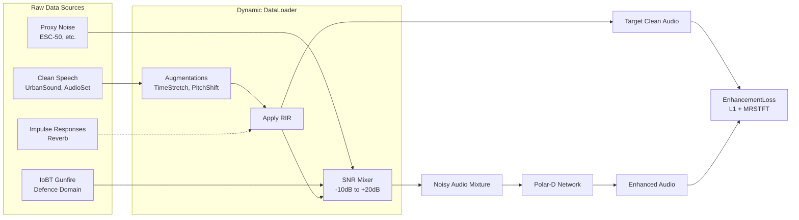
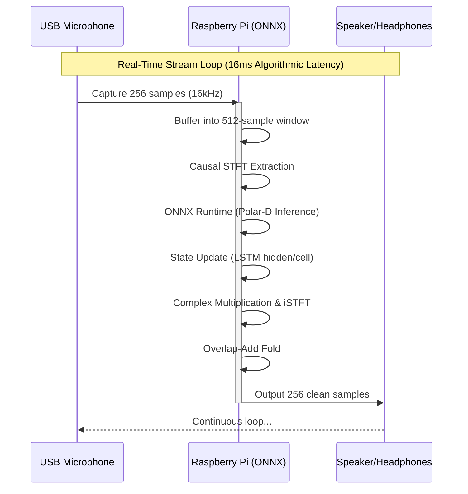

# Antigravity ANC System Diagrams

This document outlines the architecture, data pipeline, and deployment flows for the Polar-D neural noise suppression system.

## 1. Technical Flow (Polar-D Architecture)

The core neural engine operates strictly causally, processing incoming audio frame-by-frame suitable for real-time embedded streaming.

```mermaid
flowchart TD
    %% Inputs
    AudioIn[Noisy Audio Waveform] --> STFT
    
    %% Feature Extraction
    subgraph Signal Processing [Signal Processing]
        STFT[Causal STFT<br>center=False, n_fft=512, hop=256]
        Concat[Concat Real & Imaginary]
        iSTFT[Causal Inverse STFT<br>overlap-add fold]
    end
    
    %% Neural Network Core
    subgraph Polar-D [Polar-D Neural Core]
        LSTM[2-Layer Stateful LSTM<br>hidden_size=256]
        FC_Mag[Linear -> Sigmoid * 2.0<br>Magnitude Mask: 0 to 2.0]
        FC_Phase[Linear -> Tanh * π<br>Phase Mask: -π to π]
        ComplexConvert[Combine Mag & Phase<br>mag * exp(j * phase)]
    end
    
    %% Connections
    STFT -->|Complex Spectrogram| Concat
    STFT -->|Noisy Spectrogram| ComplexMult((x))
    
    Concat -->|Features: B x T x 514| LSTM
    LSTM --> FC_Mag
    LSTM --> FC_Phase
    
    FC_Mag --> ComplexConvert
    FC_Phase --> ComplexConvert
    
    ComplexConvert -->|Complex Ratio Mask| ComplexMult
    ComplexMult -->|Enhanced Spectrogram| iSTFT
    
    iSTFT --> AudioOut[Enhanced Audio Waveform]
```

## 2. Data Sources & Training Pipeline

The dynamic mixer aggressively augments clean audio with proxy noises, genuine gunfire, and impulse responses (RIRs) to create robust training mixtures on the fly.



## 3. User Flow (Embedded Deployment)

The deployment flow demonstrates how a user interfaces with the embedded ONNX model running on a Raspberry Pi device in the field.


